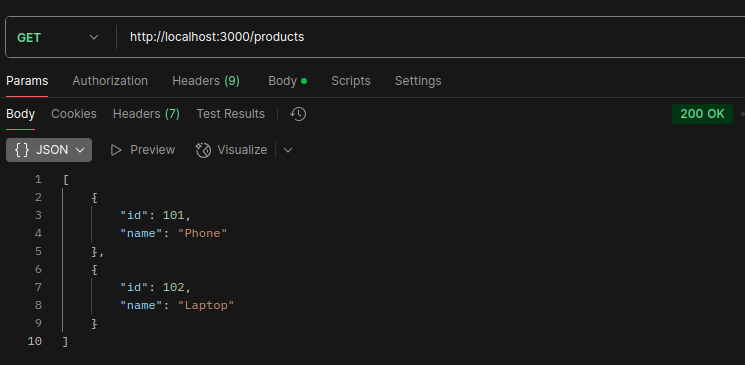

# 🚀 Exercises - ExpressJS

---

## 🧩 I - Introduction to ExpressJS [Article](https://daaif.net/article/express-js-introduction)
1. [Exercise 1: Simple ExpressJS Server](#-exercise-1-simple-expressjs-server)
2. [Exercise 2: ExpressJS Project Setup](#-exercise-2-expressjs-project-setup)

---


### 📌 Exercise 1: Simple ExpressJS Server

**🎯 Objective:**

Create a basic ExpressJS server that:
- Responds with `"Hello World"` on the root route (`/`)
- Displays the **current date and time** on `/date`

**💻 Solution Code:**

```javascript
const express = require('express');
const app = express();
const port = 3000;

app.get('/', (req, res) => {
    res.send('Hello World!');
});

app.get('/date', (req, res) => {
    const currentDate = new Date().toLocaleString();
    res.send(`Current date and time: ${currentDate}`);
});

app.listen(port, () => {
    console.log(`Server running at http://localhost:${port}`);
});
```

**📸 Screenshots:**

- 
- 

---

### 📌 Exercise 2: ExpressJS Project Setup

**🎯 Objective:**

Create a structured ExpressJS project with:
- Organized directory structure
- Static files handling
- Multiple custom routes

**📁 Project Structure:**

``` 
project/
│
├── node_modules
├── controllers
├── middlewares
├── models
├── views
├── public/
│   ├── css/
│   ├── js/
│   └── images/
├── routes/
│   ├── index.js
│   └── api.js
├── package-lock.json
├── package.json 
└── app.js
```

**💻 Main Application (app.js):**

```javascript
const express = require('express');
const path = require('path');
const indexRouter = require('./routes/index');
const apiRouter = require('./routes/api');

const app = express();
const port = 3000;

app.use(express.json());
app.use(express.urlencoded({ extended: false }));
app.use(express.static(path.join(__dirname, 'public')));

app.use('/', indexRouter);
app.use('/api', apiRouter);

app.use(express.static('public'));

app.listen(port, () => {
    console.log(`Server running at http://localhost:${port}`);
});
```

**💻 Index Route (routes/index.js):**

```javascript
const express = require('express');
const router = express.Router();

router.get('/', (req, res) => {
    res.send('Welcome to the homepage!');
});

module.exports = router;
```

**💻 API Route (routes/api.js):**

```javascript
const express = require('express');
const router = express.Router();

router.get('/data', (req, res) => {
    res.json({ message: 'API response', status: 200 });
});

module.exports = router;
```

**📸 Screenshots:**

- 
- 
- 

---

## 🧩 [II - Routage avec ExpressJS](https://daaif.net/article/express-js-routage)
1. [Exercise 1: Basic Task Manager API](#-exercise-1-basic-task-manager-api)
2. [Exercise 2: Implementing Parameterized Routes](#-exercise-2-implementing-parameterized-routes)
3. [Exercise 3: Organizing an Application with Modular Routers](#-exercise-3-organizing-an-application-with-modular-routers)


### 📌 Exercise 1: Basic Task Manager API

**🎯 Objective:**

Create a basic RESTful API using ExpressJS to manage tasks.
- `GET /tasks` : List all tasks
- `GET /tasks/:id` : Get task by ID
- `POST /tasks` : Create new task
- `PUT /tasks/:id` : Update task
- `DELETE /tasks/:id`: Delete task

**💻 Solution Code:**

```javascript
const express = require('express');
const app = express();
app.use(express.json());

let tasks = [
  { id: 1, title: 'Learn Express', completed: false },
  { id: 2, title: 'Build API project', completed: true }
];

app.get('/tasks', (req, res) => {
  res.json(tasks);
});

app.get('/tasks/:id', (req, res) => {
  const task = tasks.find(t => t.id === parseInt(req.params.id));
  if (!task) return res.status(404).send('Task not found');
  res.json(task);
});

app.post('/tasks', (req, res) => {
  const task = {
    id: tasks.length + 1,
    title: req.body.title,
    completed: false
  };
  tasks.push(task);
  res.status(201).json(task);
});

app.put('/tasks/:id', (req, res) => {
  const task = tasks.find(t => t.id === parseInt(req.params.id));
  if (!task) return res.status(404).send('Task not found');
  task.title = req.body.title;
  task.completed = req.body.completed;
  res.json(task);
});

app.delete('/tasks/:id', (req, res) => {
  const taskId = parseInt(req.params.id);
  const initialLength = tasks.length;
  
  tasks = tasks.filter(t => t.id !== taskId);
  
  if (tasks.length < initialLength) {
    res.status(200).json({ message: `Task with ID ${taskId} has been deleted successfully` });
  } else {
    res.status(404).json({ message: `Task with ID ${taskId} not found` });
  }
});
  

app.listen(3000, () => {
  console.log('Server is running on port 3000');
});

```

**📸 Screenshots:**

- 
- 
- 
- 
- 

---

### 📌 Exercise 2: Implementing Parameterized Routes

**🎯 Objective:**

Create a blog API using parameterized routes:
- `GET /posts/:year/:month?` :  Retrieve blog posts from a specific year, and optionally from a specific month.
- `GET /categories/:categoryName/posts` : Retrieve blog posts from a specific category.

**💻 Solution Code:**

```javascript
const express = require('express');
const app = express();
const port = 3000;

const posts = [
    { title: 'Post 1', year: '2024', month: '04', category: 'tech' },
    { title: 'Post 2', year: '2024', month: '03', category: 'life' },
    { title: 'Post 3', year: '2023', month: '04', category: 'tech' },
];

app.get('/posts/:year', (req, res) => {
    const { year } = req.params;
    const filtered = posts.filter(p => p.year === year);
    res.send(`📝 Posts from year ${year}:\n${JSON.stringify(filtered, null, 2)}`);
});

app.get('/posts/:year/:month', (req, res) => {
    const { year, month } = req.params;
    const filtered = posts.filter(p => p.year === year && p.month === month);
    res.send(`📝 Posts from ${month}/${year}:\n${JSON.stringify(filtered, null, 2)}`);
});

app.get('/posts', (req, res) => {
    const { year, month } = req.query;
    let filtered = posts;
    
    if (year) filtered = filtered.filter(p => p.year === year);
    if (month) filtered = filtered.filter(p => p.month === month);
    
    res.send(`📝 Filtered posts:\n${JSON.stringify(filtered, null, 2)}`);
});

app.get('/categories/:categoryName/posts', (req, res) => {
    const { categoryName } = req.params;
    const filtered = posts.filter(p => p.category === categoryName);
    res.send(`📚 Posts in category "${categoryName}":\n${JSON.stringify(filtered, null, 2)}`);
});

app.listen(port, () => {
    console.log(`✅ Blog API running at http://localhost:${port}`);
});
```

**📸 Screenshots:**

- 
- 
- 

---

### 📌 Exercise 3: Organizing an Application with Modular Routers

**🎯 Objective:**

Refactor an existing ExpressJS application using modular routers to separate concerns for different resources like::
- `Users`
- `Products`
- `Orders`

**📁 Project Structure:**

``` 
project/
├── routes/
│   ├── users.js
│   ├── products.js
│   └── orders.js
├── app.js
└── package.json
```

**💻 Main Application (app.js):**
```javascript
const express = require('express');
const app = express();
const port = 3000;

const usersRouter = require('./routes/users');
const productsRouter = require('./routes/products');
const ordersRouter = require('./routes/orders');

app.use('/users', usersRouter);
app.use('/products', productsRouter);
app.use('/orders', ordersRouter);

app.listen(port, () => {
  console.log(`Server is running at http://localhost:${port}`);
});

```

**💻  (routes/users.js):**

```javascript
const express = require('express');
const router = express.Router();

const users = [
  { id: 1, name: 'Alice' },
  { id: 2, name: 'Bob' }
];

router.get('/', (req, res) => {
  res.json(users);
});

router.get('/:id', (req, res) => {
  const user = users.find(u => u.id === parseInt(req.params.id));
  if (user) {
    res.json(user);
  } else {
    res.status(404).send('User not found');
  }
});

module.exports = router;

```

**💻  (routes/products.js):**

```javascript
const express = require('express');
const router = express.Router();

const products = [
  { id: 101, name: 'Phone' },
  { id: 102, name: 'Laptop' }
];

router.get('/', (req, res) => {
  res.json(products);
});

router.get('/:id', (req, res) => {
  const product = products.find(p => p.id === parseInt(req.params.id));
  product ? res.json(product) : res.status(404).send('Product not found');
});

module.exports = router;

```

**💻  (routes/orders.js):**

```javascript
const express = require('express');
const router = express.Router();

const orders = [
  { id: 201, user: 'Alice', product: 'Phone' },
  { id: 202, user: 'Bob', product: 'Laptop' }
];

router.get('/', (req, res) => {
  res.json(orders);
});

router.get('/:id', (req, res) => {
  const order = orders.find(o => o.id === parseInt(req.params.id));
  order ? res.json(order) : res.status(404).send('Order not found');
});

module.exports = router;
```


**📸 Screenshots:**

- 
- 
- 

---


## 🧩 [III - Les Middlewares dans ExpressJS](https://daaif.net/article/express-js-middlewares)
1. [Exercise 1: Create a Custom Logging Middleware](#-exercise-1-create-a-custom-logging-middleware)
2. [Exercise 2: Implement a Simple Authentication Middleware](#-exercise-2-implement-a-simple-authentication-middleware)
3. [Exercise 3: Use Popular Third-Party Middlewares](#-exercise-3-use-popular-third-party-middlewares)


### 📌 Exercise 1: Create a Custom Logging Middleware

**🎯 Objective:**

Create a middleware that logs each request’s:
- `Method` - `URL` - `Timestamp` - `IP Address`

**💻  (server.js):**
```javascript
const express = require('express');
const fs = require('fs');
const path = require('path');

const app = express();

const logger = (req, res, next) => {
  const log = `${new Date().toISOString()} - ${req.method} ${req.url} - IP: ${req.ip}\n`;
  fs.appendFile(path.join(__dirname, 'log.txt'), log, (err) => {
    if (err) throw err;
  });
  next();
};

app.use(logger);

app.get('/', (req, res) => {
  res.send('Hello from home!');
});

app.get('/about', (req, res) => {
  res.send('This is the about page.');
});

const PORT = 3000;
app.listen(PORT, () => {
  console.log(`Server is running on http://localhost:${PORT}`);
});
```


**📸 Screenshots:**

- 

---

### 📌 Exercise 2: Implement a Simple Authentication Middleware

**🎯 Objective:**

Block access if request does not contain a valid token.

**💻  (server.js):**
```javascript
const express = require('express');
const app = express();
const port = 3000;

const auth = (req, res, next) => {
  const token = req.headers['authorization'];
  if (token === 'mysecrettoken') {
    next();
  } else {
    res.status(401).json({ error: 'Unauthorized' });
  }
};

app.use('/secure', auth);

app.get('/secure/data', (req, res) => {
  res.json({ secret: 'This is protected data.' });
});

app.listen(port, () => {
  console.log(`Server running at http://localhost:${port}`);
});
```
**📸 Screenshots:**

- 
- 

---
### 📌 Exercise 3: Use Popular Third-Party Middlewares

**🎯 Objective:**

Set up and order multiple middlewares properly.

**💻  (server.js):**
```javascript
const express = require('express');
const morgan = require('morgan');
const cors = require('cors');
const compression = require('compression');

const app = express();

app.use(morgan('dev'));
app.use(cors());
app.use(compression());

app.get('/', (req, res) => {
  res.send('Middlewares are working!');
});
```
**📸 Screenshots:**

- 
- 

---

## 🧩 [IV - Handling Requests and Responses](https://daaif.net/article/express-js-request-response)
1. [Exercise 1: Create and Handle a Signup Form](#-exercise-1-create-and-handle-a-signup-form)
2. [Exercise 2: Upload and Display an Image](#-exercise-2-upload-and-display-an-image)
3. [Exercise 3: Respond with JSON, HTML, or XML](#-exercise-3-respond-with-json-html-or-xml)

### 📌 Exercise 1: Create and Handle a Signup Form

**🎯 Objective:**

Create a simple HTML form and handle the submitted data using `req.body`.

**💻  (server.js):**
```javascript
const express = require('express');
const app = express();
const port = 3000;

app.use(express.urlencoded({ extended: true }));

app.get('/signup', (req, res) => {
  res.send(`
    <form action="/signup" method="post">
      <label>Name: <input name="name" required /></label><br>
      <label>Email: <input name="email" type="email" required /></label><br>
      <label>Password: <input name="password" type="password" required /></label><br>
      <button type="submit">Sign Up</button>
    </form>
  `);
});

app.post('/signup', (req, res) => {
  const { name, email, password } = req.body;

  if (!name || !email || !password) {
    return res.status(400).send('All fields are required');
  }

  res.send(`Welcome ${name}, you are signed up.`);
});

app.listen(port, () => {
  console.log(`Server running at http://localhost:${port}`);
});
```

**📸 Screenshots:**

- 
- 

---

### 📌 Exercise 2: Upload and Display an Image

**🎯 Objective:**

Allow users to `upload` an image using a form and `show` the uploaded image on success.


**💻  (server.js):**
```javascript
const express = require('express');
const multer = require('multer');
const path = require('path');
const app = express();
const port = 3000;
const fs = require('fs');

const storage = multer.diskStorage({
  destination: 'uploads/',
  filename: (req, file, cb) => {
    cb(null, Date.now() + path.extname(file.originalname));
  }
});

const upload = multer({
  storage,
  limits: { fileSize: 5 * 1024 * 1024 },
  fileFilter: (req, file, cb) => {
    const types = ['image/jpeg', 'image/png', 'image/gif'];
    cb(null, types.includes(file.mimetype));
  }
});

app.use(express.static('uploads'));

app.get('/upload', (req, res) => {
  fs.readdir('uploads', (err, files) => {
    if (err) return res.status(500).send('Error reading files');

    const images = files.map(file => ``).join('');

    res.send(`
      <form action="/upload" method="post" enctype="multipart/form-data">
        <input type="file" name="image" accept="image/*" required />
        <button type="submit">Upload</button>
      </form>
      <hr>
      <h3>Gallery:</h3>
      ${images}
    `);
  });
});


app.post('/upload', upload.single('image'), (req, res) => {
  if (!req.file) return res.status(400).send('Invalid file');

  res.send(`Image uploaded:<br>`);
});

app.listen(port, () => {
  console.log(`Server running at http://localhost:${port}`);
});
```

**📸 Screenshots:**

- 
- 

---


### 📌 Exercise 3: Respond with JSON, HTML, or XML

**🎯 Objective:**

Use `res.format()` to respond with data in different content types based on the client's request.


**💻  (server.js):**
```javascript
const express = require('express');
const app = express();
const port = 3000;

app.get('/api/data', (req, res) => {
  const data = {
    name: 'Express',
    type: 'Framework',
    language: 'JavaScript'
  };

  res.format({
    'application/json': () => res.json(data),

    'text/html': () => res.send(`
      <ul>
        <li><strong>Name:</strong> ${data.name}</li>
        <li><strong>Type:</strong> ${data.type}</li>
        <li><strong>Language:</strong> ${data.language}</li>
      </ul>
    `),

    'application/xml': () => res.send(`
      <data>
        <name>${data.name}</name>
        <type>${data.type}</type>
        <language>${data.language}</language>
      </data>
    `),

    default: () => res.status(406).send('Not Acceptable')
  });
});

app.listen(port, () => {
  console.log(`Server running at http://localhost:${port}`);
});
```

**📸 Screenshots:**

- 
- 
- 

---


✍️ Author: [Essaadouny Abdelouahed]  
📅 Last Updated: Apr 17, 2025
